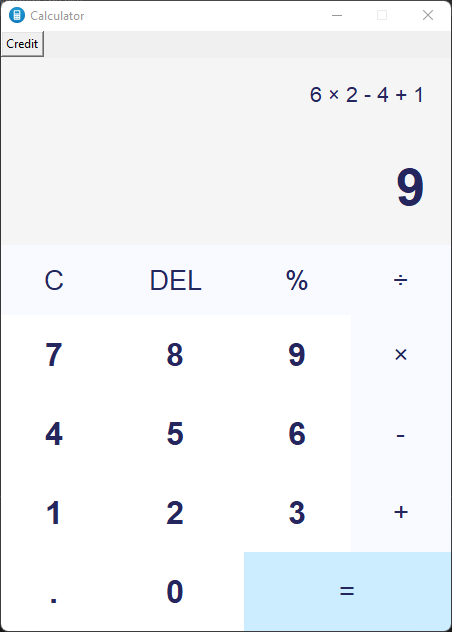

# Calculator
Python Calculator App using Python and tkinter.



---

## Create Standalone Executable

```shell
pip install pyinstaller
pyinstaller --onefile -w calc.py 
[Before using powershell in this folder, comment the icon code(line-26)]
```
